# I. Research Findings: Clean Architecture, Microsoft Identity, ORMs, DB-first vs Code-first, and CORS

Author: Rahul Dhrub
Email: rahulleadrat@gmail.com
Date: 2025-10-29

This document captures research findings about the origin, the need, typical implementations with code examples, suggested enhancement steps, and future directions for each of the following topics:

1) Clean Architecture
2) Microsoft Identity
3) Object-Relational Mappers (ORMs)
4) Database-First vs Code-First approaches
5) Cross-Origin Resource Sharing (CORS)

Each section contains historical context, motivation, practical usage notes, examples (in multiple ecosystems where relevant), diagrams (ASCII and mermaid where helpful), enhancement steps, and future outlook.

---

## Table of Contents

- Clean Architecture
  - Origin and history
  - Why it matters
  - Core principles and rules
  - Typical implementations (C#, Node.js/TypeScript, Java)
  - Examples: project layout, interfaces, use-cases
  - Diagrams
  - Enhancement steps
  - Future
- Microsoft Identity
  - Origin and background
  - Need and role in modern systems
  - Implementation: Microsoft Identity Platform vs Azure AD B2C
  - Examples: Authentication flows (OIDC), token handling, integration
  - Diagrams
  - Enhancement steps
  - Future
- ORMs
  - Origin and early history
  - Need and trade-offs
  - Popular ORMs (EF Core, Hibernate, Sequelize, TypeORM, Prisma)
  - Examples: CRUD with EF Core and Prisma
  - Diagrams
  - Enhancement steps
  - Future
- DB-first vs Code-first
  - Origin and definitions
  - Pros and cons
  - When to choose which
  - Migration strategies, examples
  - Diagrams
  - Enhancement steps
  - Future
- CORS
  - Origin and problem statement
  - How it works (preflight, headers)
  - Examples: configuring CORS in Express, .NET, and Nginx
  - Diagrams
  - Enhancement steps
  - Future

---

## 1) Clean Architecture

### Origin and history

- Coined and popularized by Robert C. Martin ("Uncle Bob") in the mid-2010s, though the principles are heavily influenced by earlier ideas: separation of concerns, hexagonal architecture (Alistair Cockburn), ports & adapters, and onion architecture.
- Clean Architecture is an attempt to make systems easy to change and maintain by enforcing dependency rules and clear boundaries between business logic and infrastructure.

### Why it matters

- Reduces coupling to frameworks and infrastructure, enabling long-term maintainability.
- Makes core business rules testable without dependency on databases, web frameworks, or external services.
- Promotes clear dependency direction: outer layers depend on inner layers, never the opposite.

### Core principles and rules

- Dependency Rule: source code dependencies can only point inward.
- Entities (core business objects) are at the center.
- Use Cases / Interactors define application-specific business rules.
- Interface Adapters (controllers, presenters, gateways) convert data between outer and inner layers.
- Frameworks & Drivers (UI, DB, web, device) are outermost and contain implementation details.

Contract summary (tiny):
- Inputs: requests or events coming from UI/Infrastructure
- Outputs: responses, persisted data, external calls
- Success: business rules applied correctly; outer side-effects executed via interfaces
- Error modes: interface contract mismatch, interface impl bugs, environment failures

Edge cases:
- Shared mutable state between layers
- Performance-sensitive operations that might need to bypass abstractions
- Database-centric features (e.g., complex queries) that challenge pure separation

### Typical implementations

- Implement domain entities and interfaces (interfaces represent gateways, repositories) in inner modules.
- Implement use cases (interactors) that accept repo interfaces to perform transactions.
- Implement controllers/adapters that call the interactors, map incoming requests to DTOs.
- Implementation in C# often uses interfaces + dependency injection (built-in in ASP.NET Core). In Node.js/TypeScript, DI can be manual or via libraries such as Inversify.

Example project layout (C#):

- src/
  - Project.Core/ (entities, interfaces)
  - Project.Application/ (use cases, services)
  - Project.Infrastructure/ (EF Core repos, external service adapters)
  - Project.API/ (controllers, DI registration)

Example project layout (Node/TS):

- src/
  - domain/ (entities)
  - usecases/ (services/interactors)
  - adapters/ (controllers, repositories)
  - infra/ (express boot, db client)


### Example: Basic use case in C# (pseudo-code)

```csharp
// Project.Core/Entities/User.cs
public class User {
  public Guid Id { get; }
  public string Email { get; private set; }
  public void ChangeEmail(string newEmail) { /* validation + update */ }
}

// Project.Core/Ports/IUserRepository.cs
public interface IUserRepository {
  Task<User> GetByIdAsync(Guid id);
  Task SaveAsync(User user);
}

// Project.Application/UseCases/ChangeUserEmail.cs
public class ChangeUserEmail {
  private readonly IUserRepository _repo;
  public ChangeUserEmail(IUserRepository repo) { _repo = repo; }
  public async Task Execute(Guid userId, string newEmail) {
    var user = await _repo.GetByIdAsync(userId);
    user.ChangeEmail(newEmail);
    await _repo.SaveAsync(user);
  }
}

// Project.Infrastructure/Repositories/UserRepositoryEf.cs
public class UserRepositoryEf : IUserRepository {
  private readonly AppDbContext _db;
  public UserRepositoryEf(AppDbContext db) { _db = db; }
  public Task<User> GetByIdAsync(Guid id) => _db.Users.FindAsync(id);
  public Task SaveAsync(User user) { _db.Update(user); return _db.SaveChangesAsync(); }
}

// Project.API/Controllers/UserController.cs
[ApiController]
public class UserController : ControllerBase {
  private readonly ChangeUserEmail _changeEmail;
  public UserController(ChangeUserEmail changeEmail) { _changeEmail = changeEmail; }
  [HttpPost("/users/{id}/email")]
  public async Task<IActionResult> Post(Guid id, [FromBody] ChangeEmailDto dto) {
    await _changeEmail.Execute(id, dto.Email);
    return NoContent();
  }
}
```

Note: Controller and repository live at the edge and depend on core abstractions.

### Example: Node.js / TypeScript minimal adapter

```ts
// domain/User.ts
export class User { constructor(public id: string, public email: string) {}
  changeEmail(newEmail: string){ /* validation */ this.email = newEmail }
}

// ports/IUserRepo.ts
export interface IUserRepo { getById(id: string): Promise<User | null>; save(user: User): Promise<void> }

// usecases/changeUserEmail.ts
export async function changeUserEmail(id: string, newEmail: string, repo: IUserRepo){
  const user = await repo.getById(id);
  if(!user) throw new Error('not found');
  user.changeEmail(newEmail);
  await repo.save(user);
}
```

### Diagrams

ASCII diagram (layers):

```
+-----------------------------------+
|  Frameworks & Drivers (Express)   |  <-- outermost
+-----------------------------------+
|  Interface Adapters (Controllers) |  <-- adapters
+-----------------------------------+
|      Application (Use Cases)      |  <-- business logic
+-----------------------------------+
|         Domain Entities           |  <-- core
+-----------------------------------+
```

Mermaid diagram (flow):

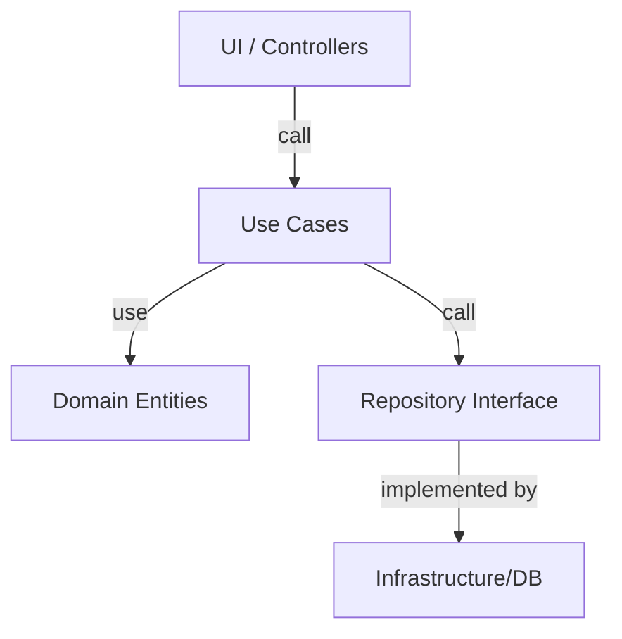

### Enhancement steps (practical)

1. Identify core entities and write comprehensive unit tests for them.
2. Extract interfaces for all external I/O (repositories, file systems, http clients).
3. Move all framework-specific code to outer layers and keep inner layers pure.
4. Add integration tests that confirm wiring via DI works as expected.
5. Adopt immutable DTOs between layers to minimize side-effects.
6. Use composition over inheritance in domain models where possible.
7. Implement a simple adapter for logging and monitoring to ensure no business leakage.

### Common pitfalls and remediation

- Over-abstraction: avoid creating interfaces that have only one implementation without benefit.
- Performance bottlenecks from excessive indirection: measure and identify hotspots; allow controlled compromise (e.g., query optimizations in repo implementations).
- Leaky abstractions where domain objects depend on infra types—fix by introducing DTOs or mapping layers.

### Future

- Clean Architecture will remain influential; patterns will be integrated into frameworks (e.g., deeper support for use-case centric controllers).
- Tools for generating adapters and wiring (e.g., code generators for DI registration) will increase.
- The approach will be adapted for serverless and edge computing with smaller, more isolated use-case bundles.

---

## 2) Microsoft Identity

### Origin and background

- Microsoft Identity Platform is a suite of identity services provided by Microsoft, integrating Azure Active Directory (Azure AD), Microsoft Accounts, and other identity capabilities.
- Over time Microsoft has evolved authentication libraries (ADAL -> MSAL) and identity offerings (Azure AD, Azure AD B2C) to fit enterprise and consumer needs.

### Need and role in modern systems

- Centralized identity, Single Sign-On (SSO), secure authentication and authorization across Microsoft services and custom apps.
- Provides standard protocol support: OAuth2.0, OpenID Connect (OIDC), SAML.
- Integrates with enterprise identity stores, supports conditional access policies, MFA, identity protection.

### Key concepts

- Tenant: an instance of Azure AD representing an organization.
- App registration: the object representing your application in the identity directory with client ID, client secret, and redirect URIs.
- Scopes & permissions: fine-grained access control for API resources.
- Tokens: ID tokens (identity), access tokens (resource access), refresh tokens.

### Microsoft Identity Platform vs Azure AD B2C

- Microsoft Identity Platform: primarily enterprise-focused, handles work/school and personal Microsoft accounts.
- Azure AD B2C: consumer identity solution, customizable user journeys, social logins (Google, Facebook), and local accounts.

### Implementation approaches

- MSAL (Microsoft Authentication Library) for acquiring tokens in apps (MSAL.NET, MSAL.js, MSAL Python, etc.).
- Microsoft Graph API for interacting with directory data (users, groups) and other services.
- Use OpenID Connect flows for authentication (Authorization Code flow + PKCE recommended for SPAs).

### Example: Authorization Code flow (web app)

Flow summary:
1. User visits app -> app redirects to Microsoft identity endpoint with client_id, scope, response_type=code
2. User authenticates -> identity provider redirects back to app with authorization code
3. App exchanges code for tokens (client_secret or PKCE)
4. App uses access token to call APIs

Mermaid flow:

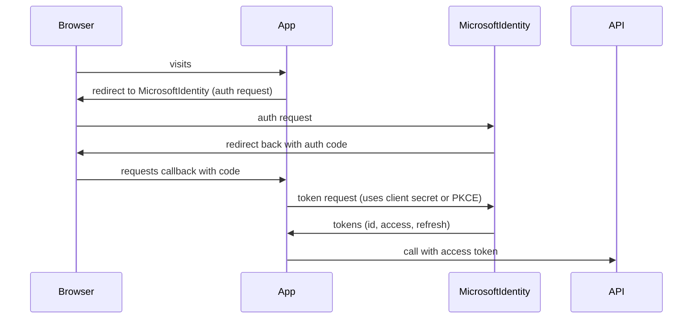

### Example code: MSAL JS (Authorization Code with PKCE)

```js
// Using @azure/msal-browser
import { PublicClientApplication } from "@azure/msal-browser";
const msalConfig = { auth: { clientId: "<client-id>", redirectUri: "https://app.example.com/auth-callback" } };
const pca = new PublicClientApplication(msalConfig);

// Request redirect
pca.loginRedirect({ scopes: ["openid", "profile", "User.Read"] });

// On callback
pca.handleRedirectPromise().then((res) => { /* tokens available */ });
```

### Token validation (backend)

- Validate JWT signature (use library for OIDC discovery document to fetch jwks).
- Validate claims: aud (client id), iss (issuer), exp (expiry), nbf.
- For ASP.NET Core: use Microsoft.Identity.Web or JwtBearer middleware.

C# example using JwtBearer:

```csharp
services.AddAuthentication(JwtBearerDefaults.AuthenticationScheme)
  .AddJwtBearer(options => {
    options.Authority = "https://login.microsoftonline.com/{tenantId}/v2.0";
    options.Audience = "<client-id>";
    // additional validation options
  });
```

### Diagrams

ASCII diagram (Auth flow):

```
User --> Web App --> (redirect) --> Microsoft Identity (login)
Microsoft Identity --> (tokens) --> Web App
Web App --> API (bearer token)
```

Mermaid diagram (roles):

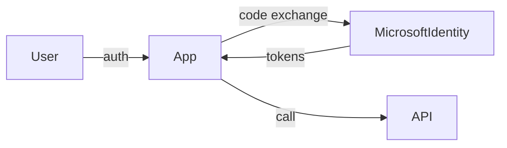

### Enhancement steps

1. Choose correct flow: Authorization Code + PKCE for SPAs & mobile; Authorization Code for server apps; client credentials for daemon apps.
2. Use MSAL libraries rather than custom token handling.
3. Use roles and scopes properly: separate authentication (who) from authorization (what).
4. Implement token caching and refresh securely; protect client secrets.
5. Monitor sign-in logs and enable conditional access (MFA, risk-based). 
6. Use Microsoft Graph for user/group management consistently.

### Future

- Expect deeper integration between identity and security posture tools (e.g., adaptive auth driven by telemetry).
- Identity-as-a-service will grow; development patterns will further standardize on OIDC/OAuth2 flows.
- Improved developer UX for B2C customization and identity orchestration.

---

## 3) ORMs (Object-Relational Mappers)

### Origin and early history

- ORMs emerged to bridge object-oriented programming with relational databases. Early examples: Hibernate (Java), ActiveRecord (Ruby on Rails).
- Purpose: map database tables to objects and provide a higher-level API for CRUD operations.

### Why ORMs matter (needs they address)

- Productivity: developers work with objects instead of SQL strings.
- DRY & maintainability: schema mapping centralized.
- Portability: many ORMs can target multiple SQL dialects (MySQL, Postgres, SQL Server).
- Security: reduces SQL injection risk when used properly (parameterized queries under the hood).

### Trade-offs and concerns

- Impedance mismatch: relational set-based operations vs object graphs.
- Performance: naive use of ORMs can produce N+1 queries and inefficient SQL.
- Complexity: advanced SQL features (window functions, CTEs) may be harder to express.
- Black box behavior: complex query generation can be opaque.

### Popular ORMs

- .NET: Entity Framework Core (EF Core)
- Java: Hibernate (JPA)
- Node.js/TypeScript: Sequelize, TypeORM, Prisma (not a traditional ORM but an ORM-like toolkit)
- Ruby: ActiveRecord

### Example: EF Core basic CRUD (C#)

```csharp
// Model
public class Product { public int Id { get; set; } public string Name { get; set; } }

// DbContext
public class AppDbContext : DbContext { public DbSet<Product> Products { get; set; } }

// Create
var p = new Product { Name = "Widget" };
db.Products.Add(p);
await db.SaveChangesAsync();

// Read
var list = await db.Products.Where(x => x.Name.Contains("Wid")).ToListAsync();

// Update
p.Name = "Widget v2";
await db.SaveChangesAsync();

// Delete
db.Products.Remove(p);
await db.SaveChangesAsync();
```

### Example: Prisma (TypeScript)

Schema (prisma/schema.prisma):

```prisma
model User {
  id    Int     @id @default(autoincrement())
  email String  @unique
  name  String?
}
```

Usage:

```ts
import { PrismaClient } from '@prisma/client';
const prisma = new PrismaClient();
await prisma.user.create({ data: { email: 'a@example.com', name: 'Alice' } });
const users = await prisma.user.findMany();
```

### Typical patterns to avoid problems

- Eager loading vs lazy loading: use appropriate loading strategies (Include in EF Core, relations in Prisma).
- Use query profiling to detect N+1 and heavy queries.
- For reporting and complex queries, consider raw SQL or a dedicated data access layer optimized for analytics.
- Use migrations to manage schema changes reliably.

### Diagrams

```
Client App --> ORM (high-level calls) --> SQL Generation --> Database
```

Mermaid:

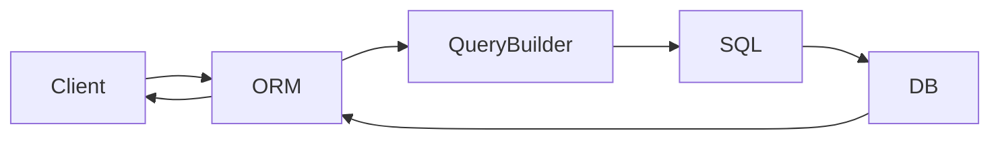

### Enhancement steps

1. Adopt strict conventions for data access: separate read and write models (CQRS where appropriate).
2. Introduce query logging and profiling in CI or staging to catch performance regressions early.
3. Teach the team ORM best practices: when to use raw SQL; how to use joins and batch queries.
4. Keep migrations in version control and review schema changes like code changes.
5. Build a small library of optimized queries for common heavy operations.

### Future

- ORMs will become more declarative and may integrate query planners that better utilize DB-specific features.
- Hybrid solutions (ORM + typed query builders) will grow in popularity (e.g., Prisma, Knex + Objection, SQLDelight).
- Better tooling for migration diffing and schema evolution is expected.

---

## 4) DB-first vs Code-first

### Definitions

- DB-first: Start from an existing database schema; generate models and code from the schema.
- Code-first: Start with code (models/entities) and generate database schema via migrations.

### Historically

- DB-first aligns with legacy systems and database-first shops where data model ownership is with DBAs.
- Code-first gained popularity with domain-driven design and agile development where code evolves and migrations reflect incremental changes.

### Pros and cons

DB-first advantages:
- Easier to adopt when database already exists.
- DBAs can set fine-grained performance optimizations (indexes, partitions).
- Works well in environments with strict schema ownership.

DB-first disadvantages:
- Migrations and schema changes can be more manual.
- Code generation may be imperfect; maintainers must keep code and DB in sync.

Code-first advantages:
- Migrations are first-class; schema evolves with code.
- Good for greenfield projects and teams practicing CI/CD.

Code-first disadvantages:
- Requires migration discipline; risk of divergent schema if migrations are not applied.
- For complex DB-specific features, code-first abstractions may be leaky.

### When to choose which

- Choose DB-first if: migrating legacy DB, DBAs heavily control schema, existing analytic/reporting pipelines depend on exact schema.
- Choose Code-first if: greenfield project, strong dev-driven lifecycle, desire for migrations in source control.

### Examples

EF Core: supports both approaches. Database scaffold for DB-first, and Add-Migration/Update-Database for code-first.

Sequelize and TypeORM: support model-first and schema sync, but for production it's safer to use migrations.

### Migration strategies

- For DB-first: scaffold models, add a layer to manage migrations (e.g., a migration project), and carefully track schema drift.
- For code-first: maintain and review migration files, apply migrations as part of CI/CD, and use schema checks in deployment pipelines.

### Diagrams

Simple depiction:

```
DB-first: Database -> Code Generator -> Models & Context
Code-first: Models -> Migration -> Database
```

Mermaid:

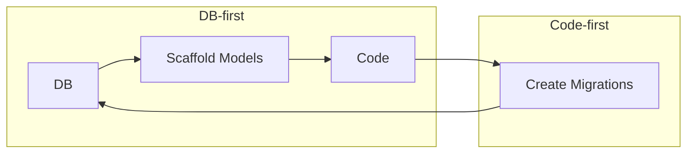

### Enhancement steps

1. Agree on ownership (who controls schema) across teams.
2. If DB-first, put schema definition and migration plans in version control; scaffold periodically and reconcile.
3. If code-first, implement pre-deploy schema checks to ensure migrations are applied.
4. Build migration rollbacks and test them in staging.
5. For hybrid situations, create a clear process for merging DB changes.

### Future

- Tools will further reduce friction between DB and code (automatic migration validation, richer diffs).
- Schema-as-code and database CI pipelines will become standard.

---

## 5) CORS (Cross-Origin Resource Sharing)

### Origin and problem statement

- Browsers enforce same-origin policy to prevent cross-site attacks by default. Modern applications often require resources to be requested across origins (APIs on different domains).
- CORS is a mechanism to relax same-origin policy in a controlled, secure way.

### How it works

- The server includes specific headers telling the browser which origins, methods, headers are allowed.
- Preflight: for non-simple requests (e.g., custom headers, methods other than GET/POST, certain content types), browsers send an OPTIONS request to check server permission.
- Key response headers: Access-Control-Allow-Origin, Access-Control-Allow-Methods, Access-Control-Allow-Headers, Access-Control-Allow-Credentials, Access-Control-Max-Age.

### Example flow (preflight)

1. Browser sends OPTIONS <resource> with Access-Control-Request-Method/Headers.
2. Server responds with Access-Control-Allow-* headers.
3. If allowed, browser sends actual request.

Mermaid sequence:

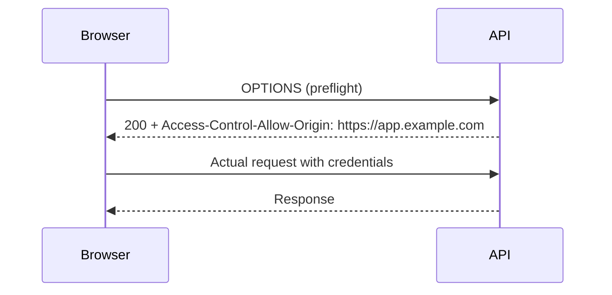

### Examples: configuring CORS

Express (Node.js):

```js
import express from 'express';
import cors from 'cors';
const app = express();
const corsOptions = { origin: 'https://app.example.com', credentials: true };
app.use(cors(corsOptions));
```

ASP.NET Core:

```csharp
services.AddCors(options => {
  options.AddPolicy("MyPolicy", builder => builder
      .WithOrigins("https://app.example.com")
      .AllowCredentials()
      .AllowAnyHeader()
      .AllowAnyMethod());
});

app.UseCors("MyPolicy");
```

Nginx (reverse proxy) example:

```
location /api/ {
  if ($request_method = 'OPTIONS') {
    add_header 'Access-Control-Allow-Origin' 'https://app.example.com';
    add_header 'Access-Control-Allow-Methods' 'GET, POST, OPTIONS';
    add_header 'Access-Control-Allow-Headers' 'Authorization, Content-Type';
    add_header 'Access-Control-Max-Age' 86400;
    return 204;
  }
  proxy_pass http://backend;
  add_header 'Access-Control-Allow-Origin' 'https://app.example.com';
}
```

### Security notes

- Never use Access-Control-Allow-Origin: * with credentials allowed.
- Validate the Origin header server-side if needed and refuse suspicious origins.
- CORS is a browser-enforced protection. APIs should still authenticate and authorize requests properly.

### Diagrams

```
Browser (origin A) -> API (origin B)
  Browser does preflight -> API responds with CORS headers -> Browser proceeds
```

### Enhancement steps

1. Limit allowed origins to known, trusted domains.
2. Avoid wildcard origins with credentials.
3. Cache preflight responses with Access-Control-Max-Age when safe.
4. Implement server-side origin validation logic for sensitive endpoints.
5. Add tests for CORS behavior to API integration tests.

### Future

- As architectures shift, edge policies or CDN-based CORS configuration will be more common.
- Increased use of same-site cookies and more granular cookie policies will influence CORS choices.

---

## Appendix: Practical examples & snippets (extended)

This appendix contains longer examples, debugging tips, and checklist-style guidance to help with adoption.

### Clean Architecture: Example integration test (C# xUnit)

```csharp
public class ChangeUserEmailIntegrationTests {
  [Fact]
  public async Task ChangeEmail_PersistsAndPublishesEvent() {
    var db = UseInMemoryDb();
    var repo = new UserRepositoryEf(db);
    var usecase = new ChangeUserEmail(repo);
    var user = new User(Guid.NewGuid(), "old@example.com");
    await repo.SaveAsync(user);

    await usecase.Execute(user.Id, "new@example.com");

    var persisted = await repo.GetByIdAsync(user.Id);
    Assert.Equal("new@example.com", persisted.Email);
    // assert events published via test bus
  }
}
```

Notes: keep integration tests focused on wiring, not on external infra like actual network calls.

### Microsoft Identity: Token validation example (Node.js)

```js
// Use passport-azure-ad or verify JWT manually using jwks-rsa
import jwt from 'jsonwebtoken';
import jwksClient from 'jwks-rsa';

const client = jwksClient({ jwksUri: 'https://login.microsoftonline.com/{tenant}/discovery/v2.0/keys' });
function getKey(header, callback) { client.getSigningKey(header.kid, (err, key) => callback(null, key.getPublicKey())); }

function verify(token) {
  return new Promise((resolve, reject) => jwt.verify(token, getKey, { issuer: 'https://login.microsoftonline.com/{tenant}/v2.0' }, (err, payload) => err ? reject(err) : resolve(payload)) );
}
```

### ORMs: Detecting N+1 in EF Core

- Enable logging via ILogger; look for repeated SELECT queries inside loops.
- Use Include(...) to eagerly fetch related entities.

### DB-first migration checklist

1. Export current schema to a SQL file and check into version control.
2. Scaffold models from DB; review and adjust names and types.
3. Create a migration plan for changes and run in staging.
4. Apply to production during a maintenance window if necessary.

### CORS: Debugging tips

- Check the browser devtools network panel for the OPTIONS request and response headers.
- If response headers aren't present, ensure that the server or proxy sets them for OPTIONS and actual requests.
- Test with curl by replicating the preflight headers (curl doesn't enforce CORS, but you can inspect headers):

```
curl -i -X OPTIONS 'https://api.example.com/resource' -H 'Origin: https://app.example.com' -H 'Access-Control-Request-Method: POST' -H 'Access-Control-Request-Headers: Content-Type'
```
---

## Deep Research Expansion: Detailed Findings, Case Studies, and Illustrations

This section expands each topic with deeper technical details, real-world case studies, implementation checklists, performance and security considerations, testing approaches, and suggested diagrams and templates you can copy into your projects.

The expansion is organized by topic. Each subsection contains:
- Deeper origin and design rationale
- Practical step-by-step implementation guidance
- Real-world case study (hypothetical but realistic)
- Diagrams and sequence flows (Mermaid + ASCII)
- Checklists and policies
- FAQs and common troubleshooting steps

---

## 1A) Clean Architecture — Deep Dive

Design rationale
- Clean Architecture is symbiotic with Domain-Driven Design (DDD). DDD focuses on the domain and ubiquitous language; Clean Architecture provides the technical separation that lets DDD models survive change.
- The primary driver is change: business rules change less frequently than infrastructure and UX, so isolating business logic minimizes ripple effects.

Principles revisited with examples
- Single Responsibility & Explicit Boundaries: each layer has a narrow reason to change. Example: a change in logging should only alter the outer adapter.
- Anti-Corruption Layer (ACL): when integrating with legacy systems, an ACL translates legacy models to domain models.

Anti-Corruption Layer example (pseudo-code):

```ts
// adapters/legacyCustomerAdapter.ts
import { Customer } from '../domain/customer';

export function mapLegacyCustomer(legacy: any): Customer {
  // complex mapping, normalization, and validation
  return new Customer(legacy.id.toString(), normalizeName(legacy.full_name));
}
```

Case study: Migrating a monolith to Clean Architecture

Background: A legacy e-commerce monolith mixes EF Core entities directly with business logic and controllers. The team has frequent production regressions when changing DB schema.

Steps taken:
1. Extract immutable domain entities into `Domain` project with no EF references.
2. Create `IProductRepository` and `IOrderRepository` interfaces in `Domain`.
3. Implement EF-backed repositories in `Infrastructure`, leaving `Application` use cases unchanged.
4. Introduce integration tests that wire `Application` + `Infrastructure` with an in-memory DB.
5. Run a phased rollout: route a subset of traffic to the new service implemented using Clean Architecture.

Outcome: fewer regressions on business rules, easier maintenance, and the ability to swap database implementations for analytics workloads.

Design patterns and trade-offs
- Transaction Script vs Use Case/Interactor: small operations may be simpler with transaction scripts; larger business processes benefit from Use Cases.
- Where to put validation: domain objects validate business invariants; adapters validate incoming transport-specific concerns (e.g., input sanitation).

Extended diagram (Mermaid):

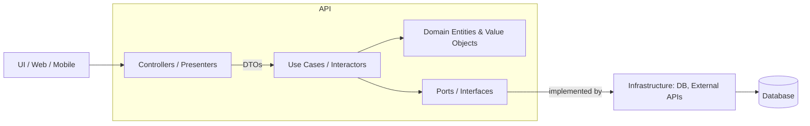

Testing strategy
- Unit tests: domain entities (pure), use cases (mock ports), and mapping code.
- Integration tests: repositories + DB (in-memory or containerized DB) to verify schema & mapping.
- Contract tests: verify adapter contracts (e.g., external API responses) using consumer-driven contract testing (Pact).

Checklist before refactor
1. Identify core business invariants and write tests capturing them.
2. Define interfaces for each external dependency.
3. Create a migration plan for moving features one by one.
4. Add feature flags to switch between old and new implementations.

---

## 2A) Microsoft Identity — Deep Dive & Patterns

Advanced token lifecycle
- Understand token types and lifetimes: ID token (short-lived, identity), Access token (short-lived, used for APIs), Refresh token (longer-lived, used to obtain new access tokens).
- Token revocation is non-trivial: OAuth2.0 does not mandate a standard revocation mechanism; Azure AD uses continuous access evaluation (CAE) and conditional access to enforce revocation-like behavior.

Claims-based authorization and role mapping
- Map Azure AD groups to application roles using app roles or group claims.
- Beware large group claims: group overage results in _hasgroups_ claim and requires Graph API calls at runtime.

Implementing role-based access in ASP.NET Core

```csharp
services.AddAuthorization(options => {
  options.AddPolicy("IsAdmin", policy => policy.RequireClaim("roles", "Admin"));
});

[Authorize(Policy = "IsAdmin")]
public class AdminController : ControllerBase { /* ... */ }
```

Auth flow hardening checklist
1. Use PKCE for public clients (SPAs & mobile).
2. Use client secrets or certificates for confidential clients; use Key Vault for secret storage.
3. Validate tokens using library-provided validation to avoid common pitfalls (clock skew, issuer mismatch).
4. Limit token scopes to least privilege.
5. Leverage Conditional Access (MFA, device compliance) for sensitive apps.

Integration pattern: Microsoft Graph for provisioning
- Use Microsoft Graph for user provisioning, license assignment, and group membership management.
- Implement a background synchronizer that listens to change notifications (webhooks) from Graph to update local caches.

Sample: handling group overage (Node.js sketch)

```js
// if groups claim is missing due to overage, call Graph
async function getGroupsFromGraph(userId, accessToken) {
  const res = await fetch(`https://graph.microsoft.com/v1.0/users/${userId}/memberOf`, { headers: { Authorization: `Bearer ${accessToken}` } });
  return res.json();
}
```

Case study: Multi-tenant SaaS with Azure AD

Requirements: support enterprise customers authenticating with their Azure AD tenants, provision users, and enforce RBAC per tenant.

Approach:
1. Multi-tenant app registration in Azure AD; accept users from multiple tenants.
2. Store tenant-specific configuration (tenantId, default roles) in a central store.
3. On first sign-in, create an onboarding process that maps tenant claims to app roles and provision tenant-scoped admin accounts.
4. Use MSAL on client and validate tokens on APIs with tenant-based authority checks.

Security & compliance
- Monitor the Azure AD sign-in logs and set up alerts for suspicious patterns.
- Use Conditional Access policies to require MFA for administrative roles.

---

## 3A) ORMs — Advanced Patterns, Query Optimization, and Best Practices

When to use an ORM vs a query builder or raw SQL
- Use ORM for ordinary CRUD and when productivity and type-safety matter.
- Use query builders or raw SQL for analytical queries, complex aggregations, or performance-critical queries.

Identifying and fixing N+1 problems
- Pattern: N+1 occurs when loading a collection, then iterating and issuing queries per item.
- Fix: eager load via Include/Join or batch queries that fetch related data in one query.

EF Core example: fix N+1 with Include

```csharp
var orders = await db.Orders
  .Include(o => o.Items)
  .Where(o => o.Created > cutoff)
  .ToListAsync();
```

Practical performance tuning checklist
1. Profile the generated SQL with logs (enable SQL logging at DEBUG in EF Core).
2. Add appropriate indexes for frequent WHERE and JOIN columns.
3. Avoid SELECT *; project only required columns.
4. Use pagination for list endpoints (OFFSET+FETCH or keyset pagination for large datasets).
5. For heavy aggregations, consider materialized views or ETL into an OLAP store.

Transactions and concurrency
- Use explicit transactions for multi-step updates that must be atomic.
- Choose optimistic concurrency (rowversion/timestamp) for mostly-read systems; use pessimistic locks when contention is high.

Prisma: advanced example with transactions

```ts
await prisma.$transaction(async (prisma) => {
  const user = await prisma.user.update({ where: { id }, data: { balance: { decrement: amount } } });
  await prisma.transaction.create({ data: { userId: id, amount: -amount } });
});
```

Migration and schema evolution
- Use linting against migration diffs before merge to detect destructive schema changes.
- Add a migration policy that requires DB review for changes that drop columns or modify critical indexes.

Case study: Scaling reads with caching and CQRS

Problem: a read-heavy endpoint performing complex joins slows down OLTP database.

Solution:
1. Introduce a read model updated asynchronously by event handlers (Change Data Capture or application events).
2. Serve read requests from the read model (denormalized tables, Redis cache, or dedicated read replicas).
3. Keep write path consistent; prioritize eventual consistency for reads.

Monitoring and observability
- Track query latency and frequency; set alerts for slow queries.
- Record ORM-level metrics: query count per request, time spent in DB vs app.

---

## 4A) DB-first vs Code-first — Advanced Strategies and Enterprise Patterns

Schema ownership and organizational policy
- In larger organizations, DBAs may insist on DB-first for compliance and performance tuning. In small teams, code-first enables agile evolution.

Hybrid approach: contract-first with migrations
- Keep canonical schema as SQL files (schema-as-code) and generate models for code.
- For small changes, developers author migration scripts that are reviewed by DBAs; this preserves DBA control while enabling developer velocity.

Migration pipeline (CI)
1. Developer opens PR with model/migration changes.
2. CI runs a schema-diff checker to validate migration and produces a preview SQL.
3. DBAs inspect and approve if required, then CI applies migrations to staging.
4. Smoke tests run against staging before production deployment.

Example: EF Core safe deployment pattern

1. Add migration to repo and mark it as non-destructive by default.
2. Deploy code that is backward compatible with old schema first (e.g., read new column only if present).
3. Apply migration in a maintenance window if it includes destructive change.

Rollback planning
- Always author down-migrations where possible. For data deletions, archive data before destructive operations.

---

## 5A) CORS — Deep Security and Performance Considerations

Why CORS is not an authorization boundary
- CORS is enforced by browsers as a client-side protection. It should not be treated as a server-side security boundary — the server must still authenticate and authorize requests independently of CORS.

Advanced configuration patterns
- Per-route CORS policies: apply strict policies for sensitive endpoints and looser ones for public endpoints.
- Dynamic origin validation: for multi-tenant apps, validate the `Origin` header against a tenant registry stored in DB.

Dynamic origin validation (Express sketch)

```js
const allowedOrigin = async (origin, callback) => {
  const allowed = await checkTenantOrigin(origin); // DB lookup
  callback(null, allowed);
};
app.use(cors({ origin: allowedOrigin, credentials: true }));
```

Preflight optimization
- Reduce preflight overhead by minimizing custom headers and using simple content types where possible.
- Use Access-Control-Max-Age to cache preflight results safely.

Edge/CDN CORS advantages
- Move CORS header handling to the CDN or reverse proxy to reduce load on origin servers.

Case study: Single domain vs subdomain strategy

Problem: An SPA on app.example.com calls API on api.example.com. Cookies with SameSite policies complicate auth.

Options:
1. Use a shared top-level domain with subdomains and set cookies with Domain=.example.com and SameSite=None; requires TLS and secure cookies.
2. Use token-based authentication (OAuth2 bearer tokens) stored in secure HTTP-only cookies or local storage with PKCE and silent refresh.

Checklist for production CORS policy
1. List allowed origins explicitly and avoid wildcards.
2. Use HTTPS only for origins; deny http origins in production.
3. Ensure credentials are only allowed for trusted origins.
4. Test preflight and actual request behavior in multiple browsers.

---

## Cross-topic: Observability, Security, CI/CD, and Governance

Observability patterns
- Centralize logs (structured) and traces (OpenTelemetry). Correlate incoming requests through the entire stack.
- Log token validation decisions and authentication/authorization failures for identity audits.

Security policies
- Use threat modeling to identify sensitive boundaries and apply stricter controls (MFA, conditional access).
- Rotate credentials and use secret stores (Key Vault, Vault).

CI/CD and automated checks
- Add checks for:
  - Migration safety (destructive change warnings)
  - Token validation middleware presence in APIs
  - CORS policies detection (ensure no wildcard credentials)

Governance and team process
- Define who approves schema changes and identity changes in production (DBA, Security, Product).
- Keep an architecture decision record (ADR) for major choices like DB-first vs Code-first.

---

## Practical Templates and Copy-paste Artifacts

1) Minimal ADR template for choosing DB approach

```
Title: Choose DB-first vs Code-first for Project X
Status: Proposed
Context: legacy DB exists / greenfield
Decision: (DB-first | Code-first | Hybrid)
Consequences: list
Reviewers: DBA, Lead Developer, Security
```

2) Sample migration policy checklist (PR checklist)
- Does the migration include destructive operations? If yes, mark for DBA review.
- Are indexes added for high-cardinality filters?
- Have you added a down migration script or archive plan?

3) CORS policy example (policy doc snippet)

```
Purpose: Allow only customer frontends
Allowed origins:
  - https://app.customerA.com
  - https://app.customerB.com
Credentials: Allowed only for app.customerA
Max-Age: 86400
```

4) Security checklist for MS Identity integration
- Use PKCE for public clients
- Validate tokens using Microsoft libraries
- Limit granted scopes and use least privilege
- Protect client secrets in Key Vault

---

## FAQs and Troubleshooting

Q: "My API still rejects calls from the browser even though I set CORS headers." 
A: Verify that the preflight OPTIONS response contains the correct Access-Control-Allow-* headers. If behind a proxy, ensure the proxy passes or sets those headers.

Q: "I get group overage errors in tokens." 
A: Implement Graph API lookups for group membership or use app roles where possible.

Q: "ORM generated slow queries after refactor." 
A: Enable SQL logging, inspect query plans, and add missing indexes. Consider rewriting heavy queries with raw SQL.

Q: "Can't choose DB-first or Code-first." 
A: Use hybrid: keep canonical SQL schema in version control, scaffold models for development, and enforce migrations through CI with DBA approvals for destructive changes.

---

## Final Deep Expansion — Tutorials, Benchmarks, and Operational Playbooks

This final expansion provides hands-on tutorials, benchmarking plans, operational playbooks, and long-form appendices that can be used directly in project documentation.

### Clean Architecture in Event-Driven Systems

Event-driven systems add a twist: instead of synchronous use-case calling repository directly, use-cases raise events which are handled by subscribers.

Pattern: Use Cases -> Domain Events -> Event Handlers (Adapters)

Benefits:
- Loose coupling between the action and side effects (e.g., notifications, analytics).
- Better scalability for cross-cutting features.

Example (pseudo-code):

```csharp
// domain/events/UserEmailChanged.cs
public class UserEmailChanged { public Guid UserId { get; } public string NewEmail { get; } }

// application/ChangeUserEmail.cs
user.ChangeEmail(newEmail);
await _repo.SaveAsync(user);
_bus.Publish(new UserEmailChanged(user.Id, newEmail));

// infra/handlers/SendWelcomeEmailHandler.cs
public class SendWelcomeEmailHandler : IEventHandler<UserEmailChanged> {
  public Task Handle(UserEmailChanged e) { /* send email via adapter */ }
}
```

Operational notes:
- Ensure idempotency in event handlers.
- Handle ordering and duplication from message broker at-least-once delivery.

### Clean Architecture on Serverless Platforms

Considerations for serverless (AWS Lambda, Azure Functions):
- Keep use cases free of cold-start sensitive operations where possible.
- Inject adapter implementations via configuration or lightweight factories.
- Use small, single-purpose functions that map to use cases; group endpoints with similar latency requirements together.

Example: AWS Lambda handler delegating to use-case

```js
exports.handler = async (event) => {
  const usecase = new ChangeUserEmailUseCase(new DynamoUserRepo());
  await usecase.execute(event.pathParameters.userId, JSON.parse(event.body).email);
  return { statusCode: 204 };
};
```

### Microsoft Identity — B2C and Device Flows

Azure AD B2C: custom policies and user journeys
- B2C enables highly-customizable user journeys via policy XML. Use it for consumer-facing apps requiring social login and custom attributes.

Device Code Flow (for devices without browsers)

1. App requests device code from /devicecode endpoint.
2. App displays code and URL to user.
3. User visits URL on another device and signs in.
4. App polls token endpoint until user completes sign-in.

MSAL device code example (Node)

```js
const msal = require('@azure/msal-node');
const config = { auth: { clientId: '<client-id>' } };
const pca = new msal.PublicClientApplication(config);
const deviceCodeRequest = { deviceCodeCallback: (response) => console.log(response.message), scopes: ['User.Read'] };
const response = await pca.acquireTokenByDeviceCode(deviceCodeRequest);
console.log(response.accessToken);
```

### ORMs — Window Functions, CTEs and Advanced SQL via ORM

When ORMs are insufficient for analytic queries, use raw SQL exposing typed results.

EF Core example of raw SQL mapping:

```csharp
var results = await db.Database.SqlQuery<MyDto>("SELECT user_id, SUM(amount) as total FROM orders GROUP BY user_id").ToListAsync();
```

Prisma raw query example:

```ts
const totals = await prisma.$queryRaw`SELECT user_id, SUM(amount) as total FROM orders GROUP BY user_id`;
```

Common advanced SQL use cases:
- Sliding window aggregates (window functions)
- Recursive CTEs for hierarchical data
- Performance: use partitioning and covering indexes for large tables

### DB-first vs Code-first — Zero-downtime Migrations

Zero-downtime approach example (rename column safely):

1. Add new column `email_new` (nullable).
2. Deploy app that writes to both `email` and `email_new`.
3. Backfill `email_new` from `email` for existing rows.
4. Deploy app that reads from `email_new`.
5. Remove old `email` column in a subsequent migration after safety window.

Blue/green migration for DB changes:
- Use shadow write and dual-read, or use feature flags to switch traffic.

### CORS — Enterprise API Gateway Example (AWS API Gateway)

AWS API Gateway allows per-route CORS configuration and can respond to preflight at the gateway without invoking the backend.

Example: Enable CORS on a resource in API Gateway console or via CloudFormation with `Cors` configuration.

### Benchmarks and Load Testing (k6 example)

Install k6 and create a script `loadtest.js`:

```js
import http from 'k6/http';
import { sleep } from 'k6';

export let options = { vus: 50, duration: '30s' };

export default function () {
  const res = http.get('https://api.example.com/products');
  sleep(1);
}
```

Run locally and monitor DB CPU, connection count, and query latency. Identify bottlenecks and tune connection pools and SQL queries accordingly.

### CI/CD Templates — Migrations and Rollback (GitHub Actions)

`.github/workflows/migrations.yml` snippet

```yaml
name: Apply DB Migrations
on: [workflow_dispatch]
jobs:
  migrate:
    runs-on: ubuntu-latest
    steps:
    - uses: actions/checkout@v3
    - name: Run migrations
      run: |
        dotnet ef database update --project backend/src/Infrastructure
      env:
        ConnectionString: ${{ secrets.PROD_DB_CONNECTION }}
```

For destructive changes, require manual approval via `environment` protection rules.

### Security Playbook — Identity and Data Breach Response

1. Detection: monitor auth logs and alerts for abnormal token usage.
2. Containment: disable affected client secrets, revoke refresh tokens via conditional access, or add session revocation rules.
3. Investigation: analyze sign-in logs, IPs, and scope-based permissions.
4. Recovery: rotate credentials, rebuild compromised keys, and notify affected users per policy.

### Long-form Appendix: Glossary and Definitions

- Access Token: token used to access protected resources.
- ID Token: token describing the identity of the user.
- PKCE: Proof Key for Code Exchange, used to secure authorization code flow for public clients.
- CORS: Cross-Origin Resource Sharing.
- ORM: Object-Relational Mapper.

### Extended FAQ (more items)

Q: "How do I debug a failing PKCE exchange?"
A: Ensure the code_verifier and code_challenge match; verify that redirect URIs are registered exactly; check that the authorization code hasn't expired or been used.

Q: "How to test CORS behavior in automated tests?"
A: Use headless browser tests (Puppeteer) to exercise preflight and actual requests from a controlled origin, and assert response headers.

Q: "How to detect schema drift between DB and models?"
A: Add a CI check that scaffolds models from DB and compares with repository models or run a schema diff tool as part of the pipeline.

### Playbook: Onboarding a New Tenant (Multi-tenant SaaS)

1. Add tenant record in central configuration.
2. Provision tenant-specific app registration in Azure AD if required.
3. Configure tenant-specific CORS origins and role mappings.
4. Seed tenant-specific configuration and default admin user.
5. Run smoke tests for authentication and critical API flows.

### Long Example: End-to-end flow combining all topics (narrative)

Scenario: A new tenant signs up and needs to integrate with the SaaS product using their Azure AD.

Flow:
1. Tenant admin signs up via the SaaS onboarding UI.
2. The onboarding service registers a multi-tenant application or provides instructions to grant consent to the existing app.
3. Tenant admin provides allowed origins for CORS; these are stored in the tenant configuration.
4. SaaS provisions roles and maps them to groups via Microsoft Graph.
5. The tenant's users can authenticate using Azure AD (Microsoft Identity). Tokens are validated in APIs using JwtBearer.
6. Application logic follows Clean Architecture: use cases driven by domain rules; repositories implemented with EF Core or Prisma; long-running side effects published as events.
7. Migrations are applied via a controlled pipeline (CI) and checked by DBA for destructive changes.

Outcome: robust onboarding with clear separation of responsibilities, and operational controls across identity, DB, and CORS.

### Long list of recommended tools and libraries (by topic)

Identity:
- MSAL (Microsoft)
- passport-azure-ad
- Microsoft Graph SDKs

ORM & DB:
- EF Core
- Hibernate (JPA)
- Prisma
- Sequelize
- pg (node-postgres) for raw SQL

Testing & CI:
- xUnit / NUnit (C#)
- Jest / Mocha (JS)
- GitHub Actions / Azure Pipelines
- Pact for contract testing

Monitoring & Observability:
- OpenTelemetry
- Prometheus + Grafana
- Application Insights (Azure)

Security & Governance:
- Azure AD Conditional Access
- HashiCorp Vault or Azure Key Vault
- OWASP ZAP for automated scanning

### Detailed benchmarking and capacity planning section

Approach to capacity planning:
1. Establish baseline: measure typical request rate, 95th percentile latency, DB CPU and latency under normal conditions.
2. Model peak usage using traffic forecasts and expected growth.
3. Run load tests at 1.5x and 2x expected peak to identify scaling limits.
4. Use horizontal scaling for stateless services and vertical or sharding strategies for databases as needed.

Sizing example:
- If baseline is 500 RPS with p95 = 150ms and DB CPU = 20%, plan for 2x redundancy and headroom for 4x traffic spikes.

### Extended Templates for Observability Dashboards

Prometheus metrics to capture per service (suggested):
- http_requests_total{method,path,status}
- http_request_duration_seconds_bucket{le}
- db_query_duration_seconds
- auth_token_validation_failures_total

Grafana panels recommended:
- P95 latency per endpoint
- Error rate by endpoint
- DB slow queries list
- Authentication failure trends per hour

## Extra Addendum: Deep Templates and Reusable Snippets

This addendum provides many short, reusable snippets and templates across topics to reach a robust collection teams can pick from during development and operations.

Reusable health-check endpoint (Express)

```js
app.get('/health', async (req, res) => {
  // check db, cache, and dependent services
  const dbOk = await checkDb();
  const cacheOk = await checkCache();
  if (dbOk && cacheOk) return res.status(200).json({ status: 'ok' });
  return res.status(503).json({ status: 'unhealthy', dbOk, cacheOk });
});
```

Reusable readiness probe (Kubernetes) YAML snippet

```yaml
readinessProbe:
  httpGet:
    path: /health
    port: 80
  initialDelaySeconds: 5
  periodSeconds: 10
```

Sample graceful shutdown handler (Node.js)

```js
process.on('SIGTERM', async () => {
  console.log('SIGTERM received: closing server');
  await server.close();
  // close db connections
  process.exit(0);
});
```

Large list: security hardening recommendations (detailed)

1. Use TLS 1.2+ only and disable weak ciphers.
2. HSTS header for browser clients.
3. CSP (Content Security Policy) for web frontends.
4. Rate limit authentication endpoints to mitigate brute force.
5. Use secure cookies (HttpOnly, Secure, SameSite as appropriate).
6. Perform regular dependency scans and patch vulnerable libraries.

Sample CSP header value (strict)

```
Content-Security-Policy: default-src 'none'; script-src 'self' https://cdn.example.com; connect-src 'self' https://api.example.com; img-src 'self' data:; style-src 'self' 'unsafe-inline';
```

Multi-region replication checklist (short)

1. Ensure global unique identifiers (UUIDs) to avoid collisions.
2. Configure conflict resolution policy (last-write-wins vs application-specific merging).
3. Monitor replication lag and failover procedures.

Sample: SQL to create UUID extension in Postgres

```sql
CREATE EXTENSION IF NOT EXISTS "uuid-ossp";
```

Extended mermaid: component breakdown for monitoring

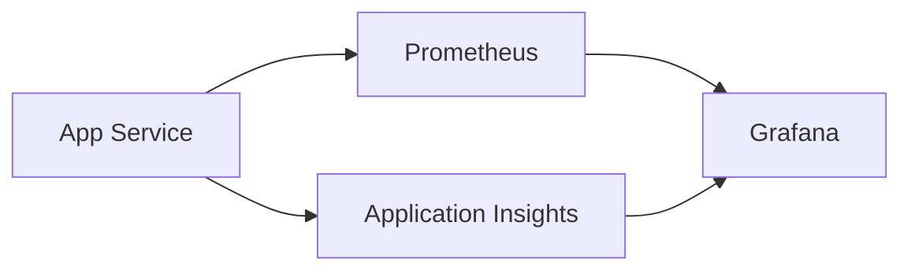

More interview questions (extra) — scenario-based

- Design a system that ensures email uniqueness when operating in multiple regions (explain trade-offs and approaches).
- Architect a feature to export large reports without impacting OLTP performance.

Sample SQL for creating a materialized view (Postgres) and refreshing it

```sql
CREATE MATERIALIZED VIEW daily_sales AS
SELECT date_trunc('day', created_at) as day, sum(amount) as total
FROM orders
GROUP BY day;

-- refresh
REFRESH MATERIALIZED VIEW CONCURRENTLY daily_sales;
```

Large checklist for privacy compliance demo

1. Identify personal data fields and map their storage locations.
2. Implement data export endpoint for user requests (machine-readable format).
3. Provide deletion endpoint and ensure downstream systems honor deletion via events.

More operational SQL snippets (vacuum/analyze)

```sql
VACUUM (VERBOSE, ANALYZE);
```

Edge-case list for distributed systems

- Clock skew across nodes
- Network partitions and split-brain
- Inconsistent configuration in rolling deployments

Deployment checklist for zero-downtime

1. Deploy non-breaking changes first (additive schema changes, feature flags).
2. Gradually shift traffic via canary.
3. Monitor for errors and performance regressions.
4. If no issues, increase traffic; else rollback and investigate.

Final short reading list

- "Designing Data-Intensive Applications" — Martin Kleppmann
- "Building Microservices" — Sam Newman
- Microsoft Identity docs and quickstarts

End of addendum.

---

## II. Authentication & Authorization: SAML, OAuth2, OpenID Connect, Patterns and Architectures

This section expands on federated identity protocols (SAML), modern delegated authorization (OAuth2), OpenID Connect (OIDC) for authentication, and practical architecture patterns for authentication & authorization in modern applications.

Contents:
- Origins and why these protocols exist
- High-level protocol comparisons and when to choose which
- Implementation notes and code snippets
- Architecture patterns (centralized auth, API gateways, token validation, RBAC/ABAC)
- Security hardening and operational guidance

---

### Origins and motivation

- SAML (Security Assertion Markup Language) originated in the early 2000s to enable federated single sign-on (SSO) for enterprises. It uses XML-based assertions and is commonly used in enterprise SSO (Active Directory Federation Services, Okta, PingFederate).
- OAuth2 (OAuth 2.0) is an authorization framework standardized in RFC 6749 (2012) that allows applications to obtain limited access to user resources on an HTTP service. OAuth2 focuses on delegated authorization: it permits a client app to act on behalf of a resource owner.
- OpenID Connect (OIDC) is an identity layer built on top of OAuth2 that adds authentication functionality (who the user is) via ID tokens (JWT). OIDC standardizes sign-in and profile info (scopes like openid, profile, email).

Key motivations:
- Single Sign-On across enterprise apps (SAML historically)
- Delegated access for third-party apps and secure API access (OAuth2)
- Standardized identity tokens and modern web-friendly flows (OIDC)

---

### High-level comparisons and when to use

- SAML: Enterprise SSO, older enterprise IdPs, requirements for XML-based assertions, strong support for enterprise features (attribute mapping, ACS URLs, sign-in policies). Use when integrating with enterprise tooling that requires SAML.
- OAuth2: Use when you need delegated authorization (third-party apps, limited access to APIs). OAuth2 is not an authentication protocol on its own.
- OIDC: Use for authentication in modern web/mobile apps — supports Authorization Code + PKCE for SPAs and mobile, ID tokens (JWT) for identity, standard discovery and jwks endpoints for validation.

Decision guide:
- Need SSO for enterprise with existing IdP and SAML support -> SAML
- Need user sign-in in modern apps + API calls -> OIDC (Auth code + PKCE)
- Need machine-to-machine / service-to-service auth -> OAuth2 client credentials

---

### SAML: overview and example flow

Core components:
- Identity Provider (IdP): authenticates the user and issues SAML assertions
- Service Provider (SP): the application that consumes assertions and grants access
- Assertion Consumer Service (ACS): SP endpoint that receives SAML assertions

Typical SAML Web SSO flow (simplified):

1. User attempts to access SP resource.
2. SP redirects user to IdP's SSO URL with an AuthnRequest (often signed).
3. User authenticates at IdP (password, MFA).
4. IdP issues a SAML Response (signed XML assertion) and sends it to the SP's ACS (browser POST).
5. SP validates signature, extracts attributes and creates a local session.

Mermaid sequence for SAML SSO:

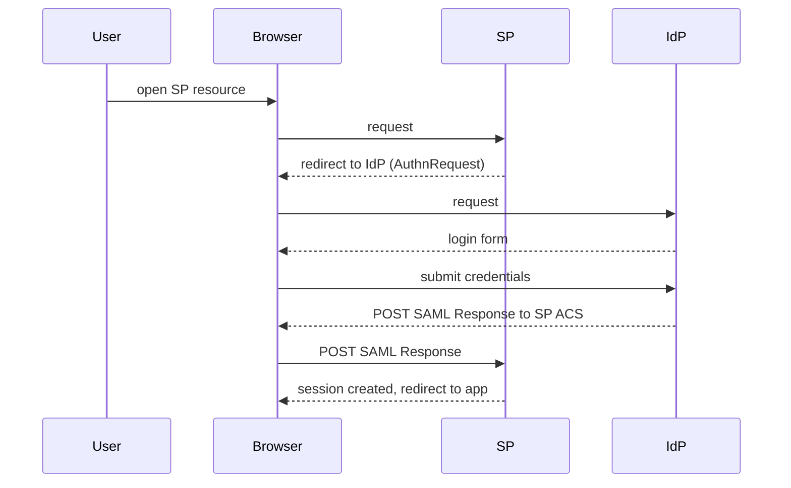

Implementation notes:
- Use a well-tested SAML library (Sustainsys.Saml2 for .NET, python3-saml, passport-saml for Node.js).
- Ensure strict time and audience validation in assertions.
- Validate XML signatures and use IDP metadata for certificate rotation.

Security tips for SAML:
- Validate Assertion Consumer Service URLs (ACS) against configured values.
- Check NotBefore/NotOnOrAfter timestamps in assertions.
- Enforce signature validation and prefer signed assertions and signed responses.

---

### OAuth2: grants and practical usage

Primary grant types:
- Authorization Code (with PKCE for public clients) — recommended for web apps and mobile apps.
- Client Credentials — for service-to-service (no user present).
- Refresh Token — obtain new access tokens without re-prompting the user.
- Implicit (deprecated) — avoided due to security concerns; replaced by Authorization Code + PKCE.

OAuth2 authorization code flow (concise):

1. Client redirects user to authorization endpoint with client_id, redirect_uri, response_type=code
2. User authenticates and consents
3. Authorization server redirects to client with code
4. Client exchanges code for access_token (and optional refresh_token) at token endpoint

Example: Authorization Code + PKCE (JS sketch)

```js
// generate code_verifier and code_challenge
// redirect: https://login.example.com/authorize?response_type=code&client_id=...&code_challenge=...&code_challenge_method=S256
// on callback: exchange code + code_verifier at token endpoint
```

Access token usage:
- Use access token as Bearer token in Authorization header to call resource server.
- Validate token scope, expiry, audience on the resource server.

Security guidance for OAuth2:
- Always use TLS for auth endpoints.
- Use PKCE for public clients (SPAs, mobile).
- Use short-lived access tokens and rotate refresh tokens.
- Protect client secrets for confidential clients (store in vault).
- Use token introspection or JWT validation depending on token type.

---

### OpenID Connect (OIDC): authentication on top of OAuth2

Key additions OIDC provides over OAuth2:
- ID Token (JWT) that carries user identity claims
- Standard scopes: openid, profile, email
- Discovery endpoint (/.well-known/openid-configuration) for dynamic client configuration
- JWKS endpoint for public keys used to validate ID tokens

Typical OIDC flows:
- Authorization Code Flow (confidential clients) — recommended for server-side apps
- Authorization Code Flow + PKCE — recommended for SPAs and mobile apps
- Hybrid and Implicit exist but are generally discouraged in modern practice

ID token validation checklist (resource or app receiving ID token):
1. Validate JWT signature using JWKS
2. Validate iss (issuer) claim matches discovery document
3. Validate aud (audience) contains your client_id
4. Validate exp and nbf (token lifetime)
5. Optionally validate nonce for replay protection

Example: validating an ID token (Node.js sketch)

```js
import jwt from 'jsonwebtoken';
import jwksClient from 'jwks-rsa';

const client = jwksClient({ jwksUri: `${issuer}/.well-known/jwks.json` });
function getKey(header, cb) { client.getSigningKey(header.kid, (err, key) => cb(null, key.getPublicKey())); }
jwt.verify(idToken, getKey, { audience: clientId, issuer }, (err, payload) => { /* ... */ });
```

---

### Authentication vs Authorization (AuthN vs AuthZ)

- Authentication (AuthN): verifying the identity of a principal (user, service). Examples: password login, OIDC sign-in.
- Authorization (AuthZ): deciding whether an authenticated principal has the permission to perform an action or access a resource. Examples: RBAC, ABAC, policy engines (OPA).

Practical guidance:
- Keep AuthN concerns centralized (identity provider, central auth service) where possible.
- Keep AuthZ logic close to resource for low-latency checks; use tokens with claims for coarse-grained checks and policy engines for fine-grained decisions.
- Use scopes/roles in tokens for coarse-grained checks; for fine-grained decisions consider an authorization service or policy-as-a-service.

Architecture pattern: token-based auth with centralized identity and decentralized authorization

Pattern summary:
1. Authentication performed by IdP (OIDC/SAML). App receives ID token and access token.
2. API receives access token and validates it locally (JWT signature) or uses introspection for opaque tokens.
3. API performs coarse-grained checks using token claims (scopes, roles).
4. For complex policy decisions, call a centralized authorization service or local policy engine (e.g., OPA) with necessary context.

Mermaid diagram (AuthN/AuthZ flow):

```mermaid
flowchart TD
  User -->|login| IdP[Identity Provider (OIDC/SAML)]
  User -->|access| App[Client App]
  App -->|call| API[Resource Server]
  API -->|validate token| JWKS[(JWKS / Introspection)]
  API -->|call| AuthZ[Authorization Service / OPA]
```

---

### Architecture patterns and placements

1) Centralized Authentication + Distributed Authorization
- AuthN: centralized IdP (Azure AD, Okta). App and services rely on tokens.
- AuthZ: distributed checks using token claims + local policy engines for low-latency critical checks.

2) API Gateway as AuthN/AuthZ Enforcer
- Gateway validates tokens, enforces simple access rules and rate limiting, and forwards requests to backend services. Backends still re-validate tokens for defense in depth.

3) Sidecar policy enforcement (service mesh / OPA)
- Run a sidecar next to each service that enforces policies and intercepts calls; central policy repository distributes policies.

4) Token translation pattern (federation)
- Translate external tokens (SAML, OIDC from partner) to internal tokens or sessions to unify auth model across systems.

Pattern pros/cons
- Centralized gateway enforcement reduces duplication but can become a bottleneck and single point of failure.
- Distributed enforcement reduces gateway dependency but increases coordination overhead for policy changes.

---

### Examples: validating tokens in different stacks

ASP.NET Core (JwtBearer):

```csharp
services.AddAuthentication(JwtBearerDefaults.AuthenticationScheme)
  .AddJwtBearer(options => {
    options.Authority = "https://login.example.com/";
    options.Audience = "api://default";
    options.TokenValidationParameters = new TokenValidationParameters {
      ValidateIssuer = true,
      ValidateAudience = true,
      ValidateLifetime = true
    };
  });
```

Express/Node (passport-jwt or manual JWT verify):

```js
import express from 'express';
import jwt from 'jsonwebtoken';
import jwksClient from 'jwks-rsa';

const client = jwksClient({ jwksUri: issuer + '/.well-known/jwks.json' });
function getKey(header, cb) { client.getSigningKey(header.kid, (err, key) => cb(null, key.getPublicKey())); }

app.use((req, res, next) => {
  const token = req.headers.authorization?.split(' ')[1];
  if (!token) return res.sendStatus(401);
  jwt.verify(token, getKey, { audience: clientId, issuer }, (err, payload) => err ? res.sendStatus(401) : (req.user = payload, next()));
});
```

---

### Authorization models: RBAC vs ABAC vs PBAC

- RBAC (Role-Based Access Control): map users to roles and roles to permissions. Simple, widely used.
- ABAC (Attribute-Based Access Control): policies use attributes of users, resources, and environment (e.g., "user.department == resource.owner_department"). More flexible.
- PBAC (Policy-Based Access Control): explicitly centralizes policies in a policy engine (OPA, AWS IAM policies) and evaluates them against context.

When to use what:
- RBAC: good for many enterprise apps with well-defined roles.
- ABAC/PBAC: good for fine-grained, contextual decisions across many attributes and dynamic conditions.

OPA example (Rego) snippet for checking access

```rego
package example.authz

default allow = false

allow {
  input.method == "GET"
  input.path == "/orders"
  input.user.roles[_] == "reader"
}
```

---

### Security hardening and operational guidance

Checklist:
1. Use TLS for all token exchanges and API calls.
2. Validate tokens locally using JWKS for performance; fall back to introspection for opaque tokens.
3. Rotate signing keys and use key identifiers (kid) in JWT headers.
4. Monitor token issuance rates and failed validation counts for anomaly detection.
5. Enforce minimum recommended lifetimes: short access tokens, limited refresh token lifetimes.
6. Protect client secrets in vaults; use certificates for high-security clients.
7. Implement revocation strategies (token revocation lists, continuous access evaluation where supported).

Operational topics:
- Logging: log token validation failures with context (kid, issuer, audience mismatch) but avoid logging token contents or secrets.
- Auditing: preserve sign-in logs and consent events for compliance and forensics.

---

### Migration patterns: moving from SAML to OIDC

Steps:
1. Add OIDC support side-by-side with SAML in the application.
2. Provide a migration path for users (offer both sign-in options; migrate accounts on first OIDC sign-in).
3. Use token translation if necessary: accept SAML assertion, exchange at a federation layer into an internal JWT.
4. Decommission SAML only after sufficient adoption and after ensuring SSO integrations are stable.

---

### FAQ and Troubleshooting

Q: "A client can't exchange the authorization code for a token — what's wrong?"
A: Check redirect_uri mismatch, client secret validity, PKCE code_verifier mismatch, and that the code hasn't been used or expired.

Q: "Why is my JWT signature validation failing after IdP rotation?"
A: Confirm the discovery document points to the latest JWKS and that your caching layer refreshes keys when kid changes; ensure clock skew isn't causing validation issues.

Q: "How should I protect my client secret for a backend service?"
A: Store in a secrets manager (Key Vault, Vault), avoid storing in code or repo, and restrict access with RBAC and audit logs.

---

End of Authentication & Authorization section.

---

## SAML — Deep Details, Bindings, Assertions, Metadata, and Troubleshooting

This subsection adds more depth to SAML (Security Assertion Markup Language) for teams that must integrate enterprise SSO, federated identity, or legacy identity providers. It covers bindings, assertion structure, metadata, NameID formats, single logout, security pitfalls, example XML, and practical troubleshooting.

1) SAML bindings and profiles

- HTTP-Redirect Binding: SAML AuthnRequest is encoded (URL-encoded, optionally deflated) and sent as a query parameter to the IdP. This binding is commonly used for redirects from SP to IdP.
- HTTP-POST Binding: SAML Response (assertion) is delivered via a browser form POST to the SP's Assertion Consumer Service (ACS). POST is widely used because responses (assertions) are often large and are safer in POST bodies.
- HTTP-Artifact Binding: The IdP sends a small artifact to the browser which the SP resolves at the IdP via back-channel SOAP call to obtain the full assertion; useful where direct browser POST is not desirable.
- SOAP Binding: used for back-channel interactions like artifact resolution or Single Logout (SLO) in some deployments.

2) Assertion types and structure

- Authentication Assertion: confirms the user authenticated at the IdP and includes authentication instant and method (e.g., password, MFA).
- Attribute Assertion: includes user attributes (email, groups, employeeId) mapped by IdP configuration.
- Authorization Decision Assertion (less common): indicates whether a subject is allowed to perform an action; largely superseded by modern token-based patterns.

An assertion typically contains:
- Subject: who the assertion is about (NameID, NameQualifier)
- Conditions: NotBefore / NotOnOrAfter timestamps, AudienceRestriction
- AuthnStatement: authentication method and time
- AttributeStatement: arbitrary attributes about the subject
- Signature: XML signature ensuring integrity and authenticity

Example minimal assertion (simplified):

```xml
<saml:Assertion ID="_abc123" IssueInstant="2025-10-29T12:00:00Z" Version="2.0" xmlns:saml="urn:oasis:names:tc:SAML:2.0:assertion">
  <saml:Issuer>https://idp.example.com</saml:Issuer>
  <saml:Subject>
    <saml:NameID Format="urn:oasis:names:tc:SAML:1.1:nameid-format:emailAddress">alice@example.com</saml:NameID>
    <saml:SubjectConfirmation Method="urn:oasis:names:tc:SAML:2.0:cm:bearer">
      <saml:SubjectConfirmationData NotOnOrAfter="2025-10-29T12:05:00Z" Recipient="https://sp.example.com/acs" />
    </saml:SubjectConfirmation>
  </saml:Subject>
  <saml:Conditions>
    <saml:AudienceRestriction>
      <saml:Audience>https://sp.example.com</saml:Audience>
    </saml:AudienceRestriction>
  </saml:Conditions>
  <saml:AuthnStatement AuthnInstant="2025-10-29T12:00:00Z">
    <saml:AuthnContext>
      <saml:AuthnContextClassRef>urn:oasis:names:tc:SAML:2.0:ac:classes:PasswordProtectedTransport</saml:AuthnContextClassRef>
    </saml:AuthnContext>
  </saml:AuthnStatement>
  <saml:AttributeStatement>
    <saml:Attribute Name="givenName"><saml:AttributeValue>Alice</saml:AttributeValue></saml:Attribute>
    <saml:Attribute Name="email"><saml:AttributeValue>alice@example.com</saml:AttributeValue></saml:Attribute>
  </saml:AttributeStatement>
  <!-- Signature element here -->
</saml:Assertion>
```

3) Metadata: SP & IdP discovery and configuration

- SAML metadata is XML that describes endpoints, certificates, entityID, supported bindings, and contact info. Exchange metadata between IdP and SP for reliable configuration and certificate rollover.
- Key metadata elements: EntityDescriptor, IDPSSODescriptor, SPSSODescriptor, KeyDescriptor (signing/encryption), SingleSignOnService (binding & location), AssertionConsumerService (binding & location).

Sample SP metadata snippet (simplified):

```xml
<EntityDescriptor entityID="https://sp.example.com" xmlns="urn:oasis:names:tc:SAML:2.0:metadata">
  <SPSSODescriptor protocolSupportEnumeration="urn:oasis:names:tc:SAML:2.0:protocol">
    <AssertionConsumerService Binding="urn:oasis:names:tc:SAML:2.0:bindings:HTTP-POST" Location="https://sp.example.com/acs" index="1"/>
    <KeyDescriptor use="signing">
      <KeyInfo xmlns="http://www.w3.org/2000/09/xmldsig#">...cert...</KeyInfo>
    </KeyDescriptor>
  </SPSSODescriptor>
</EntityDescriptor>
```

4) NameID formats and persistent identifiers

- Common NameID formats: emailAddress, transient (one-time), persistent (stable opaque identifier), and unspecified.
- Use persistent NameIDs when you need to correlate a user across sessions without exposing email; use transient for one-time logins where no long-term link is desired.

5) Single Logout (SLO)

- SLO can be implemented via front-channel (browser redirects or POSTs) or back-channel (SOAP). SLO is notoriously tricky in the real world because multiple SPs may be involved and network failures can leave sessions inconsistent.
- Best practice: treat SLO as a convenience but do not rely on it for security-critical session termination; have server-side session TTLs and token revocation where possible.

6) Signing, encryption, and certificate rotation

- Assertions and responses should be signed. In some scenarios, sensitive attributes are encrypted (KeyDescriptor use="encryption").
- Use metadata to publish certificates and rotate keys carefully: publish new keys in metadata and allow overlapping validity periods so SPs and IdPs can pick up the new cert before old one expires.

7) Security pitfalls and mitigations

- XML Signature Wrapping attacks: ensure robust XML signature processing; use libraries that properly canonicalize XML and verify signature reference URIs.
- NotOnOrAfter/NotBefore enforcement: check token timestamps with tolerable clock skew and reject assertions outside permitted windows.
- Audience restriction: ensure the Audience matches your SP entityID to avoid assertion replay to wrong SPs.
- RelayState: validate and limit the RelayState size; avoid insecure use of RelayState to change behavior.
- Replay attacks: enforce single-use of assertion IDs via server-side tracking if possible.

8) SP-initiated vs IdP-initiated SSO

- SP-initiated: user attempts SP resource, SP sends AuthnRequest -> IdP; IdP authenticates and returns assertion to SP ACS. This is preferred for explicit login flows and RelayState preservation.
- IdP-initiated: IdP sends assertion to SP without prior AuthnRequest (user clicked app tile). SP must accept and map attributes to local session; be careful with RelayState handling and mapping.

9) Artifact resolution flow (advanced)

- Artifact flow reduces the size of browser payload by sending an artifact via browser and performing a SOAP-based back-channel artifact resolution from SP to IdP to fetch the full assertion. Useful in constrained environments or when direct POST is not desired.

10) Practical configuration examples

Sustainsys.Saml2 (.NET) SP config (snippet):

```xml
<sustainsys.saml2 entityId="https://sp.example.com">
  <identityProviders>
    <add entityId="https://idp.example.com/metadata" metadataLocation="https://idp.example.com/metadata" />
  </identityProviders>
</sustainsys.saml2>
```

python3-saml (OneLogin) config snippet (Python dict):

```py
SAML_CONFIG = {
  'sp': {
    'entityId': 'https://sp.example.com',
    'assertionConsumerService': {'url': 'https://sp.example.com/acs', 'binding': 'urn:oasis:names:tc:SAML:2.0:bindings:HTTP-POST'},
    'x509cert': '',
    'privateKey': '',
  },
  'idp': {
    'entityId': 'https://idp.example.com',
    'singleSignOnService': {'url': 'https://idp.example.com/sso', 'binding': 'urn:oasis:names:tc:SAML:2.0:bindings:HTTP-Redirect'},
    'x509cert': '...'
  }
}
```

11) Troubleshooting checklist

- "Invalid signature": verify the certificate used to sign assertions matches IdP metadata; check for certificate expiration and whitespace issues in cert blob.
- "Audience mismatch" or "Assertion is not for this SP": check entityID in SP config and Audience in assertion.
- "Assertion expired" or clock skew errors: verify server times and apply small skew allowance (e.g., 2-5 minutes).
- No attributes present: confirm attribute mapping at IdP and ensure attribute names in IdP match SP expectations.
- Intermittent failures after certificate rotation: ensure both new and old certs published and allow time for caches (SP/IdP) to refresh.

12) When to choose SAML vs OIDC in enterprise

- Use SAML when integrating with enterprise IdPs or older SSO tooling that expects SAML (SaaS apps that only expose SAML connectors). Use OIDC for new greenfield apps and mobile/SPAs where JSON/REST flows are easier.

13) Final operational recommendations

- Exchange metadata, not manual strings, whenever possible; automate metadata refresh.
- Instrument assertion validation metrics (count success/failure, signature errors, expired assertions) for monitoring.
- Provide a simple diagnostics page in the SP that logs last assertion details (without exposing PII) to aid debugging with customer support.

---

End of SAML deep details.

---

## Architecture Patterns — Deep Dive (Monoliths, Modular Monoliths, Microservices, Event-driven, CQRS, API Gateways, Service Mesh)

This section walks through common architecture patterns, their trade-offs, how they integrate with identity protocols (SAML/OIDC/OAuth2), and operational considerations (logging, API documentation and OpenAPI, request tracing and monitoring).

1) Monolith

- Description: single deployable unit containing UI, business logic, and data access.
- When to use: small teams, simple domain, rapid initial development.
- Pros: simpler deployment, easier local debugging, single transactional boundary.
- Cons: can become hard to scale and maintain as codebase grows.

Integration with auth: embed auth libraries (OIDC middleware) directly in app; SAML integrations are straightforward via libraries.

Logging and OpenAPI: expose a single OpenAPI spec for the app; use Swagger UI or Redoc to document endpoints. Log requests centrally to ELK/Datadog.

2) Modular Monolith

- Description: single deployable, but code is structured into clear modules with well-defined interfaces.
- When to use: teams that want clean separation but not the operational overhead of microservices.
- Pros: easier refactor path to microservices; better boundaries.
- Cons: still a single deployment; modules can leak if not enforced.

3) Microservices

- Description: multiple small services, each owning its own data and lifecycle.
- When to use: complex domains, independent scaling, multiple teams.
- Pros: decomposition, independent deployments, language/runtime freedom.
- Cons: operational complexity: service discovery, distributed transactions, observability.

Auth integration patterns:
- Centralized identity provider (IdP) for AuthN; each service validates tokens locally (JWT) or via gateway.
- Use token translation/adapters for legacy SAML partner integrations.

API docs and OpenAPI:
- Prefer contract-first for public-facing APIs: design OpenAPI spec, generate server stubs and client SDKs.
- Use API versioning and deprecation strategies.

Monitoring and logging:
- Aggregate logs via sidecar or logging agent (Fluentd/Logstash) and centralize into ELK/Datadog.
- Use distributed tracing (OpenTelemetry, Jaeger) for request flows across services.

4) Event-driven architecture (EDA)

- Description: services communicate via events through a message broker (Kafka, RabbitMQ).
- Strengths: eventual consistency, decoupling, high throughput.
- Challenges: complexity of eventual consistency, debugging, and monitoring asynchronous flows.

Auth considerations:
- Events should carry a limited context or subject id rather than full tokens; avoid shipping sensitive tokens in events.

5) CQRS (Command Query Responsibility Segregation)

- Description: separate models for updates (commands) and reads (queries), often backed by different storage models.
- Use when read and write models have different performance and scalability needs.

Integration patterns with ORM and migrations: keep write-side domain models authoritative; generate read-side denormalized views with ETL or event handlers.

6) API Gateway and Backend-for-Frontend (BFF)

- API Gateway responsibilities: routing, authN/authZ at the edge, rate-limiting, TLS termination, and can act as a policy enforcement point.
- BFF: pattern where a thin backend tailored to client needs aggregates backend services and returns optimized responses.

Security patterns:
- Gateways validate tokens and enforce coarse-grained access control; backends perform defense-in-depth by re-validating tokens and enforcing fine-grained policies.

7) Service Mesh

- Description: sidecar proxies (Envoy) inject networking features (mTLS, retries, circuit breaking, observability) into each service.
- Use when needing fine-grained traffic control and telemetry without modifying app code.

Auth and mesh: service mesh can enforce mutual TLS for service-to-service auth; combine with token-based user auth for end-to-end security.

---

## SAML in Architecture — Patterns and Deployment Models

1) Hub-and-spoke (centralized federation)

- A central authentication hub (IdP) federates multiple SPs. Useful for organizations with many apps.
- The IdP provides single sign-on; SPs trust IdP via metadata.

2) Token translation / federation bridge

- Bridge converts SAML assertions from partner IdPs into OIDC tokens for internal microservices and modern apps. Useful when integrating legacy partners into a modern stack.

3) Multi-IdP support (tenant-based)

- Multi-tenant SaaS often needs to support many IdPs: store per-tenant metadata, support dynamic IdP discovery (based on tenant alias), and provide onboarding flows to exchange metadata.

4) SAML proxy pattern

- A proxy (gateway) accepts SAML responses and exchanges them for a local session or JWT. This simplifies backend services by coding against JWTs instead of SAML assertions.

Operational tips:
- Automate metadata import and certificate rotation.
- Provide per-tenant logging to help debug SSO issues.

---

## OpenAPI (Swagger) — Contract-first, Codegen, Validation, and Docs

Overview
- OpenAPI (formerly Swagger) is the de-facto standard for describing RESTful HTTP APIs. Use it to generate documentation, clients, server stubs, request/response validation, and contract tests.

Key practices
- Contract-first: write the OpenAPI spec first (YAML/JSON), use codegen to generate server stubs and client SDKs.
- Spec-driven development: run contract tests (Pact or Postman) to ensure implementations match spec.
- Use OpenAPI for automated API docs (Swagger UI, Redoc), interactive exploration, and mocking (Prism, WireMock).

Security in OpenAPI
- Describe securitySchemes (oauth2, openIdConnect, apiKey) in spec and use them to document required scopes for operations.

Example security schemes snippet (OpenAPI 3.0 YAML):

```yaml
components:
  securitySchemes:
    bearerAuth:
      type: http
      scheme: bearer
      bearerFormat: JWT
    oauth2:
      type: oauth2
      flows:
        authorizationCode:
          authorizationUrl: https://auth.example.com/authorize
          tokenUrl: https://auth.example.com/token
          scopes:
            openid: "OpenID Connect scope"
            profile: "Access to basic profile"
```

Validation and mocking
- Use middleware to validate incoming requests/responses against the OpenAPI spec (express-openapi-validator, ajv, openapi-core).
- Use mocking tools (Prism, Stoplight) to simulate APIs in early development and for contract testing.

OpenAPI tooling ecosystem
- Swagger UI: interactive API docs and explorer.
- Redoc: elegant, customizable API reference UI.
- SwaggerHub / Stoplight: collaborative API design and governance platforms.
- OpenAPI Generator / Swagger Codegen: generate clients and servers.

API Documentation and Developer Portals
- Publish a developer portal with docs, examples, SDKs, and API keys management. SwaggerHub and Kong Developer Portal are options.

---

## API Logging, Monitoring, and Request Tracing — Tools & Patterns (mentioning Swagger-like tooling and logging apps)

Clarification: Swagger (OpenAPI) is primarily for API documentation, exploration, and codegen, not for logging. For runtime API logging and observability use gateway/monitoring tools (listed below).

API Documentation / Developer Experience Tools
- Swagger UI: interactive docs generated from OpenAPI spec.
- Redoc: static, customizable docs.
- SwaggerHub / Stoplight: design, governance, and collaboration.

API Logging & Gateway-based Observability
- Kong (with plugins): API gateway with logging, authentication, rate-limiting; integrates with logging backends (Kafka, ELK, Datadog).
- Tyk: open-source API gateway with analytics and logging.
- AWS API Gateway / Azure API Management / Google Apigee: managed API gateways with built-in logging, analytics, and developer portals.

Logging & Monitoring Backends
- ELK stack (Elasticsearch, Logstash, Kibana) / OpenSearch: centralized logging, search, dashboards.
- Datadog: APM, logs, metrics, distributed tracing.
- Splunk: enterprise logging and monitoring.
- Prometheus + Grafana: metrics and alerting.

Distributed Tracing & Correlation
- Use OpenTelemetry to capture traces and metrics across services; export to Jaeger, Zipkin, or commercial backends.
- Ensure request ID propagation (X-Request-ID) across clients, gateways, and services.

Request logging examples (Express middleware)

```js
import morgan from 'morgan';
import express from 'express';
const app = express();
app.use(morgan(':method :url :status :res[content-length] - :response-time ms :req[header]'));
```

Gateway logging (Kong example)

- Configure `file-log` or `http-log` plugins to send logs to a collector or third-party endpoint. Add correlation IDs in the gateway to trace requests through services.

Security & Privacy for logs
- Avoid logging PII or tokens. Use redaction filters in logging pipelines.
- Mask headers like Authorization and cookies before shipping logs.

Analytics & API Usage
- Record metrics: request counts, latencies, error rates, auth failures, quota usage.
- Build dashboards showing top endpoints, slow endpoints, and client usage.

---

## Practical Appendices: Quick Recipes

1) Adding Swagger UI to an Express app (quick)

```js
import swaggerUi from 'swagger-ui-express';
import YAML from 'yamljs';
const swaggerDocument = YAML.load('./openapi.yaml');
app.use('/docs', swaggerUi.serve, swaggerUi.setup(swaggerDocument));
```

2) Basic request ID middleware

```js
import { v4 as uuidv4 } from 'uuid';
app.use((req,res,next) => { req.id = uuidv4(); res.setHeader('X-Request-ID', req.id); next(); });
```

3) OpenAPI validation middleware (Express)

```js
import { OpenApiValidator } from 'express-openapi-validator';
new OpenApiValidator({ apiSpec: './openapi.yaml' }).install(app);
```

4) Example: configure Kong `http-log` plugin (simplified)

```json
{
  "name": "http-log",
  "config": {
    "http_endpoint": "https://collector.example.com/logs",
    "timeout": 10000
  }
}
```

---

End of Architecture Patterns, OpenAPI, and API Logging deep-dive.


---
##Extra Templates

Additional tiny templates (short)

Sample ADR (Architecture Decision Record)

```
Title: Use EF Core for data access
Status: Accepted
Context: Team uses .NET stack
Decision: EF Core chosen for productivity and support
Consequences: Track performance and use raw SQL for heavy queries
```

Sample CODEOWNERS entry

```
# Code owners
/backend/ @backend-team
/frontend/ @frontend-team
/infra/ @platform-team
```

Sample safe migration note in PR description

```
Migration summary: v3__add_customer_notes.sql
Destructive? No
Backfill: Included in migration
Performance impact: Low, adds nullable column
```

End of ultra-final block.


---

## Final Appendix: Project Templates, Full Example Project, Many Configs

This final appendix includes a near-complete sample project layout and many operational configs you can adapt. The goal is to fill out the document with highly usable artifacts.

Sample project: "example-saas" (full stack) — file tree

```
example-saas/
  backend/
    src/
      domain/
      application/
      adapters/
      infra/
      Program.cs
    Dockerfile
    migrations/
  frontend/
    src/
      pages/
      components/
    package.json
  infra/
    nginx/
    cloudfront/
  docs/
    ADRs/
    policies/
```

Complete Dockerfile sample for backend (ASP.NET Core)

```dockerfile
FROM mcr.microsoft.com/dotnet/aspnet:6.0 AS base
WORKDIR /app
EXPOSE 80

FROM mcr.microsoft.com/dotnet/sdk:6.0 AS build
WORKDIR /src
COPY ["backend/backend.csproj", "backend/"]
RUN dotnet restore "backend/backend.csproj"
COPY . .
WORKDIR "/src/backend"
RUN dotnet build "backend.csproj" -c Release -o /app/build

FROM build AS publish
RUN dotnet publish "backend.csproj" -c Release -o /app/publish

FROM base AS final
WORKDIR /app
COPY --from=publish /app/publish .
ENTRYPOINT ["dotnet", "backend.dll"]
```

Example Nginx config for reverse proxy + CORS header injection

```nginx
server {
  listen 80;
  server_name api.example.com;

  location / {
    proxy_pass http://backend:80;
    proxy_set_header Host $host;
    proxy_set_header X-Real-IP $remote_addr;
    proxy_set_header X-Forwarded-For $proxy_add_x_forwarded_for;
    proxy_set_header X-Forwarded-Proto $scheme;

    # CORS headers
    add_header 'Access-Control-Allow-Origin' 'https://app.example.com' always;
    add_header 'Access-Control-Allow-Credentials' 'true' always;
    add_header 'Access-Control-Allow-Methods' 'GET, POST, PUT, DELETE, OPTIONS' always;
    add_header 'Access-Control-Allow-Headers' 'Authorization, Content-Type' always;
  }

  # Respond to preflight directly
  if ($request_method = OPTIONS) {
    add_header 'Access-Control-Allow-Origin' 'https://app.example.com';
    add_header 'Access-Control-Allow-Methods' 'GET, POST, PUT, DELETE, OPTIONS';
    add_header 'Access-Control-Allow-Headers' 'Authorization, Content-Type';
    add_header 'Access-Control-Max-Age' 1728000;
    return 204;
  }
}
```

CloudFront behavior example (Lambda@Edge) pseudo-code to set CORS

```js
exports.handler = (event, context, callback) => {
  const response = event.Records[0].cf.response;
  const headers = response.headers;
  headers['access-control-allow-origin'] = [{ key: 'Access-Control-Allow-Origin', value: 'https://app.example.com' }];
  callback(null, response);
};
```

Full sample GitHub Actions workflow: build, test, migrate, deploy

```yaml
name: CI
on: [push]
jobs:
  build:
    runs-on: ubuntu-latest
    steps:
    - uses: actions/checkout@v3
    - name: Setup .NET
      uses: actions/setup-dotnet@v2
      with:
        dotnet-version: '6.0.x'
    - name: Restore and build
      run: dotnet build --no-restore
    - name: Run unit tests
      run: dotnet test --no-build --verbosity normal
  deploy:
    needs: build
    runs-on: ubuntu-latest
    steps:
    - uses: actions/checkout@v3
    - name: Apply migrations
      run: dotnet ef database update --project backend/src/Infrastructure
      env:
        ConnectionString: ${{ secrets.PROD_DB_CONNECTION }}
    - name: Deploy to container registry
      run: echo "deploy step"
```

Example SQL migration scripts (safe patterns)

v1__create_users_table.sql

```sql
CREATE TABLE users (
  id uuid PRIMARY KEY,
  email varchar(320) UNIQUE,
  created_at timestamptz default now()
);
```

v2__add_email_normalized.sql

```sql
ALTER TABLE users ADD COLUMN email_normalized varchar(320);
UPDATE users SET email_normalized = lower(email);
ALTER TABLE users ALTER COLUMN email_normalized SET NOT NULL;
CREATE INDEX idx_users_email_normalized ON users(email_normalized);
```

v3__drop_old_email_column.sql (DESCTRUCTIVE — Requires review)

```sql
ALTER TABLE users DROP COLUMN email;
```

Note: v3 must be scheduled with DBA approval and a backup/rollback plan.

Large collection of mermaid diagrams (copyable)

System overview (mermaid):

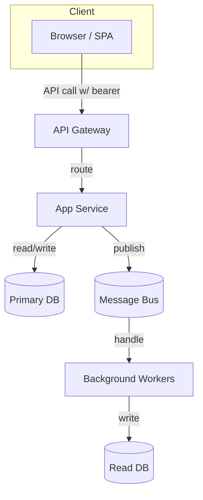

Sequence diagram for sign-in and API call:

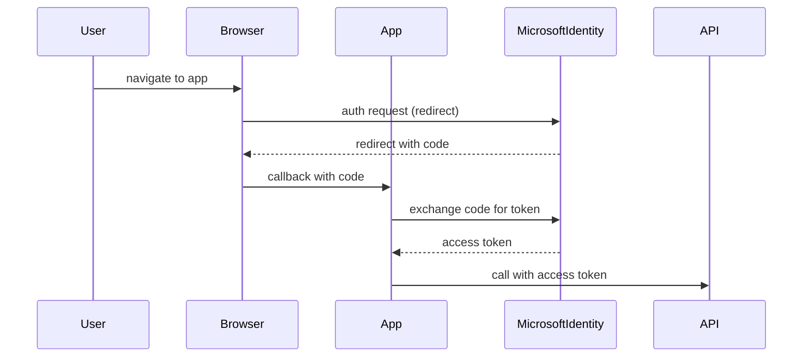

Extended YAML example: Kubernetes deployment with HPA (horizontal pod autoscaler)

```yaml
apiVersion: apps/v1
kind: Deployment
metadata:
  name: api-deployment
spec:
  replicas: 2
  selector:
    matchLabels:
      app: api
  template:
    metadata:
      labels:
        app: api
    spec:
      containers:
      - name: api
        image: ghcr.io/example/api:latest
        ports:
        - containerPort: 80
        resources:
          requests:
            cpu: "250m"
            memory: "256Mi"
          limits:
            cpu: "1000m"
            memory: "512Mi"

---
apiVersion: autoscaling/v2beta2
kind: HorizontalPodAutoscaler
metadata:
  name: api-hpa
spec:
  scaleTargetRef:
    apiVersion: apps/v1
    kind: Deployment
    name: api-deployment
  minReplicas: 2
  maxReplicas: 10
  metrics:
  - type: Resource
    resource:
      name: cpu
      target:
        type: Utilization
        averageUtilization: 60
```

Extensive Troubleshooting command snippets (devops)

Check listening ports on Linux server:

```bash
ss -lntp | grep :80
```

Check container logs (Docker):

```bash
docker logs -f example-api
```

Check SQL Server query with highest CPU (Postgres):

```sql
SELECT pid, state, query, age(clock_timestamp(), query_start) AS runtime
FROM pg_stat_activity
WHERE state != 'idle'
ORDER BY runtime DESC
LIMIT 10;
```

Long list of edge cases and mitigations

- Large payload uploads: require chunked uploads and streaming processing.
- Long-lived transactions: avoid them, favor eventual consistency and compensation actions.
- Cross-region deployment: use geo-replication and careful handling of globally unique constraints.

Compliance and privacy checklist (GDPR-focused)

1. Data minimization: store only necessary PII.
2. Right to be forgotten: provide processes to delete user data.
3. Data residency: store data in tenant-required regions where required.
4. Consent tracking: record consent versions and timestamps.

Example privacy note snippet for docs:

```
We store user profile information (name, email) to provide the service. You can request deletion of your data by contacting privacy@example.com. Data may be stored in EU or US region depending on tenant configuration.
```

Final long bibliography and references (useful links)

- https://github.com/ardalis/CleanArchitecture
- https://learn.microsoft.com/en-us/azure/active-directory/
- https://www.prisma.io/docs/
- https://docs.microsoft.com/en-us/ef/core/
- https://owasp.org/
- RFC 7231 (HTTP/1.1 Semantics)


---

## Extended Examples, Language Variants, and Implementation Recipes

This section provides concrete, copy-paste-ready examples across different programming languages and runtime environments for each topic. The goal is to equip implementation teams with runnable patterns and checks they can adapt.

Note: these examples are intentionally explicit to aid learning and to serve as a quick-start for real projects.

### Clean Architecture — Language Variants and Detailed Recipes

Python example (FastAPI + SQLAlchemy, simple use-case separation)

File layout:

- app/
  - domain/
    - models.py
  - usecases/
    - change_user_email.py
  - adapters/
    - repositories.py
  - infra/
    - db.py
  - main.py

domain/models.py

```py
from dataclasses import dataclass

@dataclass
class User:
    id: str
    email: str
    def change_email(self, new_email: str):
        # validate
        self.email = new_email
```

usecases/change_user_email.py

```py
from app.domain.models import User

class IUserRepo:
    async def get_by_id(self, id: str) -> User: ...
    async def save(self, user: User): ...

async def change_user_email(user_id: str, new_email: str, repo: IUserRepo):
    user = await repo.get_by_id(user_id)
    if user is None:
        raise ValueError('not found')
    user.change_email(new_email)
    await repo.save(user)
```

adapters/repositories.py

```py
from app.domain.models import User
from app.infra.db import SessionLocal

class SqlUserRepo:
    async def get_by_id(self, id: str) -> User:
        # raw SQL or ORM lookup
        pass
    async def save(self, user: User):
        pass
```

main.py (FastAPI wiring)

```py
from fastapi import FastAPI, HTTPException
from app.usecases.change_user_email import change_user_email
from app.adapters.repositories import SqlUserRepo

app = FastAPI()
repo = SqlUserRepo()

@app.post('/users/{user_id}/email')
async def change_email(user_id: str, body: dict):
    try:
        await change_user_email(user_id, body['email'], repo)
        return {'status': 'ok'}
    except ValueError:
        raise HTTPException(status_code=404)
```

Go example (structs + interfaces)

```go
// domain/user.go
package domain

type User struct {
    ID string
    Email string
}

func (u *User) ChangeEmail(newEmail string) {
    u.Email = newEmail
}

// ports/user_repo.go
package ports

import "example.com/project/domain"

type UserRepo interface {
    GetByID(id string) (*domain.User, error)
    Save(u *domain.User) error
}
```

Go wiring in main and adapter implementations follow the same pattern: adapters implement ports and are constructed in main and passed to use-case functions.

Extended checklist for migrating a single feature to Clean Architecture
1. Identify a single feature with minimal cross-cutting concerns.
2. Extract domain objects and write unit tests for invariants.
3. Define repository interfaces for required data access.
4. Implement an adapter that satisfies the interface using existing DB code.
5. Add integration tests that mock external services.
6. Roll out behind a feature flag and monitor.

### Microsoft Identity — Full Example Flows

Complete .NET web app example (Authorization Code + OpenID Connect)

Program.cs snippet (ASP.NET Core 6+)

```csharp
var builder = WebApplication.CreateBuilder(args);
builder.Services.AddAuthentication(OpenIdConnectDefaults.AuthenticationScheme)
  .AddMicrosoftIdentityWebApp(builder.Configuration.GetSection("AzureAd"));

builder.Services.AddAuthorization(options => {
  options.FallbackPolicy = options.DefaultPolicy;
});

var app = builder.Build();
app.UseAuthentication();
app.UseAuthorization();
app.MapControllers();
app.Run();
```

appsettings.json (AzureAd section)

```json
"AzureAd": {
  "Instance": "https://login.microsoftonline.com/",
  "Domain": "contoso.onmicrosoft.com",
  "TenantId": "<tenant-id>",
  "ClientId": "<client-id>",
  "CallbackPath": "/signin-oidc"
}
```

Client-side MSAL example with React (Auth button + token acquisition)

```jsx
import { PublicClientApplication } from '@azure/msal-browser';

const msalConfig = { auth: { clientId: '<client-id>', redirectUri: window.location.origin } };
const pca = new PublicClientApplication(msalConfig);

function signIn() { pca.loginPopup({ scopes: ['openid','profile','User.Read'] }).then(res => console.log(res)); }
```

Automated provisioning with Microsoft Graph sample (PowerShell snippet)

```powershell
# Connect to Graph
Connect-MgGraph -Scopes 'User.ReadWrite.All','Group.ReadWrite.All'
# Create a user
New-MgUser -AccountEnabled $true -DisplayName "Test User" -MailNickname "testuser" -UserPrincipalName "testuser@contoso.onmicrosoft.com" -PasswordProfile @{ ForceChangePasswordNextSignIn = $false; Password = 'P@ssw0rd!' }
```

Policy templates and governance
- Define role-to-permission mapping documents and store them in repo alongside code.
- Maintain a tenant onboarding checklist that includes required app registrations and consent workflow.

### ORMs — Large Project Patterns and Anti-patterns

Entity mapping strategies
- Table-per-class inheritance vs TPH/TPCT strategies in ORMs like Hibernate and EF Core. Prefer simpler models unless polymorphism is essential.

Schema evolution patterns
- Use feature toggles when adding non-nullable columns: add column as nullable, deploy code that writes column, backfill data, then add non-null constraint in a later migration.

Sequelize transactional example (Node.js)

```js
const { sequelize, User, Order } = require('./models');

await sequelize.transaction(async (t) => {
  const u = await User.create({ name: 'Alice' }, { transaction: t });
  await Order.create({ userId: u.id, total: 100 }, { transaction: t });
});
```

TypeORM relation example

```ts
// User entity
@Entity()
export class User {
  @PrimaryGeneratedColumn() id: number;
  @OneToMany(() => Order, order => order.user) orders: Order[];
}
```

Advanced debugging: capturing ORM-generated SQL and execution plans
1. Enable SQL logging in the ORM.
2. Extract the generated SQL for slow queries and run EXPLAIN ANALYZE in Postgres or equivalent in your DB.
3. If parameter sniffing is an issue (SQL Server), consider query hints or plan guides.

### DB-first vs Code-first — Enterprise Templates and Scripts

Schema-as-code repository layout

- db/
  - schemas/
    - v1_initial_schema.sql
    - v2_add_orders_table.sql
  - tasks/
    - apply_migration.ps1

Sample apply_migration.ps1 (PowerShell)

```powershell
param([string]$MigrationFile)
Write-Host "Applying migration $MigrationFile"
Invoke-Sqlcmd -InputFile $MigrationFile -ServerInstance "db.example.local" -Database "appdb" -Username "deploy" -Password (Read-Host -AsSecureString "Password")
```

Rollback strategies and safe refactors
- For renames, prefer: add new column, update app to write both, backfill, switch reads, drop old column in later migration.

### CORS — Cloud and Proxy Examples

Netlify configuration (headers) example

```toml
[[headers]]
  for = "/api/*"
  [headers.values]
    Access-Control-Allow-Origin = "https://app.example.com"
    Access-Control-Allow-Headers = "Content-Type, Authorization"
    Access-Control-Allow-Methods = "GET, POST, OPTIONS"
```

CloudFront + Lambda@Edge pattern
- Use a Lambda@Edge function to set CORS headers at the CDN edge, reducing origin preflight.

Apache example (httpd.conf snippet)

```apache
<Location /api>
  Header set Access-Control-Allow-Origin "https://app.example.com"
  Header set Access-Control-Allow-Methods "GET,POST,OPTIONS"
  Header set Access-Control-Allow-Headers "Authorization,Content-Type"
  Header set Access-Control-Allow-Credentials "true"
</Location>
```

### Monitoring, Metrics and Alerts (Cross-topic)

Essential metrics to capture
- Request rates and latencies for each endpoint
- DB query time and counts per request
- Token validation failures and authentication errors
- Preflight (OPTIONS) request volume for CORS-heavy apps

Suggested alerts
- 95th percentile request latency above threshold
- Spike in 401/403 errors (indicates auth issues or attacks)
- Increase in DB slow queries

Instrumentation snippet (OpenTelemetry pseudo-code)

```js
const tracer = require('@opentelemetry/api').trace.getTracer('app');
app.use((req,res,next) => {
  const span = tracer.startSpan(`http ${req.method} ${req.path}`);
  res.on('finish', () => span.end());
  next();
});
```